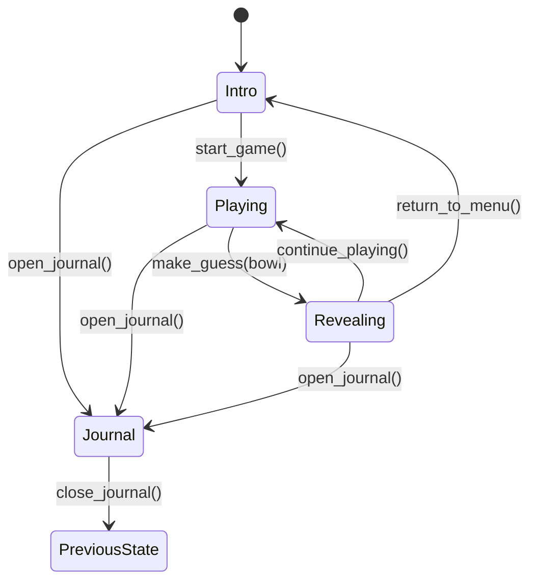

# Game State Machine Technical Specification

## Overview

This document specifies the implementation of the game state machine for "Which Bowl is the Fish In" - a fish-guessing game built with Rust and egui. The state machine manages all game flow, from the intro screen through gameplay, revealing results, and accessing the fish journal.

## Module Structure

```
src/game_state/
├── mod.rs           # Main state enum and public API
└── transitions.rs   # State transition logic and validation
```

## 1. State Enum Definition

### Primary State Enum

```rust
/// Represents all possible states in the game
#[derive(Debug, Clone, PartialEq)]
pub enum GameState {
    /// Initial screen shown when game starts
    Intro,
    
    /// Active gameplay where player selects a bowl
    Playing {
        /// The fish species currently hidden in the bowls
        selected_fish: Fish,
        /// Which bowl contains the fish (0-2 for Left, Center, Right)
        correct_bowl: BowlPosition,
    },
    
    /// Animation and feedback after player makes a guess
    Revealing {
        /// The fish that was hidden
        fish: Fish,
        /// Whether the player guessed correctly
        was_correct: bool,
        /// Current state of the reveal animation
        animation: RevealAnimation,
    },
    
    /// Fish encyclopedia/journal view
    Journal {
        /// State to return to when journal is closed
        return_to: Box<GameState>,
    },
}
```

### State Data Details

#### Intro State
- **Data**: None
- **Purpose**: Display game title, instructions, and start button
- **Duration**: Indefinite (until player action)

#### Playing State
- **selected_fish**: `Fish` struct containing:
  - Species name
  - Scientific name
  - Interesting fact
  - Image path/reference
  - Whether discovered (for journal tracking)
- **correct_bowl**: `BowlPosition` enum indicating which bowl hides the fish
- **Purpose**: Main gameplay loop where player makes their guess

#### Revealing State
- **fish**: Copy of the fish from Playing state
- **was_correct**: Boolean result of player's guess
- **animation**: `RevealAnimation` struct tracking animation progress
- **Purpose**: Show feedback and fish fact to player

#### Journal State
- **return_to**: Boxed GameState to return to when closed
  - Typically `Intro` when accessed from menu
  - Could be `Playing` if we add mid-game journal access
- **Purpose**: Display all discovered fish and their facts

## 2. Supporting Types

### BowlPosition Enum

```rust
/// Represents the three bowl positions on screen
#[derive(Debug, Clone, Copy, PartialEq, Eq, Hash)]
pub enum BowlPosition {
    Left,
    Center,
    Right,
}

impl BowlPosition {
    /// Convert to array index (0, 1, 2)
    pub fn to_index(self) -> usize {
        match self {
            BowlPosition::Left => 0,
            BowlPosition::Center => 1,
            BowlPosition::Right => 2,
        }
    }
    
    /// Create from array index
    pub fn from_index(index: usize) -> Option<Self> {
        match index {
            0 => Some(BowlPosition::Left),
            1 => Some(BowlPosition::Center),
            2 => Some(BowlPosition::Right),
            _ => None,
        }
    }
    
    /// Get all positions for iteration
    pub fn all() -> [BowlPosition; 3] {
        [BowlPosition::Left, BowlPosition::Center, BowlPosition::Right]
    }
    
    /// Get screen X position for this bowl (normalized 0.0-1.0)
    pub fn screen_position(self) -> f32 {
        match self {
            BowlPosition::Left => 0.25,
            BowlPosition::Center => 0.5,
            BowlPosition::Right => 0.75,
        }
    }
}
```

### RevealAnimation Struct

```rust
/// Tracks the state and timing of the reveal animation sequence
#[derive(Debug, Clone, PartialEq)]
pub struct RevealAnimation {
    /// Current phase of the animation
    pub phase: AnimationPhase,
    
    /// Time elapsed in current phase (seconds)
    pub phase_time: f32,
    
    /// Total animation time elapsed (seconds)
    pub total_time: f32,
    
    /// Whether animation has completed
    pub complete: bool,
}

impl RevealAnimation {
    /// Create new animation starting at FishEntry phase
    pub fn new() -> Self {
        Self {
            phase: AnimationPhase::FishEntry,
            phase_time: 0.0,
            total_time: 0.0,
            complete: false,
        }
    }
    
    /// Update animation with delta time, return true if phase changed
    pub fn update(&mut self, delta_seconds: f32) -> bool {
        if self.complete {
            return false;
        }
        
        self.phase_time += delta_seconds;
        self.total_time += delta_seconds;
        
        let phase_duration = self.phase.duration();
        if self.phase_time >= phase_duration {
            self.advance_phase()
        } else {
            false
        }
    }
    
    /// Progress of current phase (0.0 to 1.0)
    pub fn phase_progress(&self) -> f32 {
        (self.phase_time / self.phase.duration()).min(1.0)
    }
    
    /// Advance to next phase, return true if advanced
    fn advance_phase(&mut self) -> bool {
        self.phase_time = 0.0;
        
        match self.phase {
            AnimationPhase::FishEntry => {
                self.phase = AnimationPhase::ShowFact;
                true
            }
            AnimationPhase::ShowFact => {
                self.phase = AnimationPhase::FishExit;
                true
            }
            AnimationPhase::FishExit => {
                self.phase = AnimationPhase::Complete;
                self.complete = true;
                true
            }
            AnimationPhase::Complete => false,
        }
    }
    
    /// Skip to end of animation immediately
    pub fn skip_to_end(&mut self) {
        self.phase = AnimationPhase::Complete;
        self.complete = true;
        self.phase_time = 0.0;
    }
}

impl Default for RevealAnimation {
    fn default() -> Self {
        Self::new()
    }
}
```

### AnimationPhase Enum

```rust
/// Individual phases of the reveal animation sequence
#[derive(Debug, Clone, Copy, PartialEq, Eq)]
pub enum AnimationPhase {
    /// Fish enters screen from correct bowl
    FishEntry,
    
    /// Display fish fact and result message
    ShowFact,
    
    /// Fish exits screen
    FishExit,
    
    /// Animation complete, ready to transition
    Complete,
}

impl AnimationPhase {
    /// Duration of this phase in seconds
    pub fn duration(self) -> f32 {
        match self {
            AnimationPhase::FishEntry => 0.8,   // 800ms entry animation
            AnimationPhase::ShowFact => 3.5,    // 3.5s to read fact
            AnimationPhase::FishExit => 0.6,    // 600ms exit animation
            AnimationPhase::Complete => 0.0,    // No duration
        }
    }
    
    /// Total animation duration across all phases
    pub const TOTAL_DURATION: f32 = 4.9; // Sum of all phase durations
}
```

### Fish Struct

```rust
/// Represents a fish species in the game
#[derive(Debug, Clone, PartialEq)]
pub struct Fish {
    /// Common name (e.g., "Clownfish")
    pub name: String,
    
    /// Scientific name (e.g., "Amphiprioninae")
    pub scientific_name: String,
    
    /// Interesting fact about this fish
    pub fact: String,
    
    /// Asset path to fish image
    pub image_path: String,
    
    /// Whether player has discovered this fish
    pub discovered: bool,
    
    /// Unique identifier for save/load
    pub id: u32,
}

impl Fish {
    /// Mark this fish as discovered
    pub fn discover(&mut self) {
        self.discovered = true;
    }
}
```

## 3. State Transition Rules

### Valid Transitions



### Transition Matrix

| From State | To State  | Trigger Method       | Validation                          |
|-----------|-----------|---------------------|-------------------------------------|
| Intro     | Playing   | `start_game()`      | None                                |
| Intro     | Journal   | `open_journal()`    | None                                |
| Playing   | Revealing | `make_guess(bowl)`  | `bowl` must be valid position       |
| Playing   | Journal   | `open_journal()`    | Saves current Playing state         |
| Revealing | Playing   | `continue_playing()`| Animation must be complete          |
| Revealing | Intro     | `return_to_menu()`  | Animation must be complete          |
| Revealing | Journal   | `open_journal()`    | Animation must be complete          |
| Journal   | *         | `close_journal()`   | Returns to `return_to` state        |

### Invalid Transitions (Must Prevent)

1. **Direct Intro to Revealing**: Must go through Playing first
2. **Playing to Playing**: Can't start new game while in game
3. **Revealing to Revealing**: Can't re-reveal while revealing
4. **Journal recursion**: Can't open journal while already in journal
5. **Early transition from Revealing**: Must wait for animation complete

### Transition Guards

```rust
/// Errors that can occur during state transitions
#[derive(Debug, Clone, PartialEq, Eq)]
pub enum TransitionError {
    /// Attempted transition is not valid from current state
    InvalidTransition {
        from: String,
        to: String,
    },
    
    /// Transition attempted before animation complete
    AnimationNotComplete,
    
    /// Invalid bowl position provided
    InvalidBowlPosition(usize),
    
    /// Attempted to open journal while already in journal
    AlreadyInJournal,
    
    /// No fish available to start game
    NoFishAvailable,
}

impl std::fmt::Display for TransitionError {
    fn fmt(&self, f: &mut std::fmt::Formatter<'_>) -> std::fmt::Result {
        match self {
            TransitionError::InvalidTransition { from, to } => {
                write!(f, "Invalid transition from {} to {}", from, to)
            }
            TransitionError::AnimationNotComplete => {
                write!(f, "Cannot transition until animation completes")
            }
            TransitionError::InvalidBowlPosition(pos) => {
                write!(f, "Invalid bowl position: {}", pos)
            }
            TransitionError::AlreadyInJournal => {
                write!(f, "Cannot open journal while already in journal")
            }
            TransitionError::NoFishAvailable => {
                write!(f, "No fish available to start game")
            }
        }
    }
}

impl std::error::Error for TransitionError {}
```

## 4. API Specification

### Main State Manager

```rust
/// Manages game state and transitions
pub struct GameStateManager {
    /// Current game state
    current_state: GameState,
    
    /// Fish database for selecting random fish
    fish_database: FishDatabase,
    
    /// Random number generator for fish/bowl selection
    rng: rand::rngs::ThreadRng,
}

impl GameStateManager {
    /// Create new state manager starting at Intro
    pub fn new(fish_database: FishDatabase) -> Self {
        Self {
            current_state: GameState::Intro,
            fish_database,
            rng: rand::thread_rng(),
        }
    }
    
    /// Get current state (immutable)
    pub fn current_state(&self) -> &GameState {
        &self.current_state
    }
    
    /// Update animation if in Revealing state
    /// Returns true if animation completed this frame
    pub fn update(&mut self, delta_seconds: f32) -> bool {
        if let GameState::Revealing { animation, .. } = &mut self.current_state {
            if animation.update(delta_seconds) && animation.complete {
                return true;
            }
        }
        false
    }
    
    // Transition methods (see below)
}
```

### Transition Methods

#### Start Game

```rust
impl GameStateManager {
    /// Transition from Intro to Playing with new random fish and bowl
    pub fn start_game(&mut self) -> Result<(), TransitionError> {
        match &self.current_state {
            GameState::Intro => {
                let fish = self.fish_database.select_random()
                    .ok_or(TransitionError::NoFishAvailable)?;
                
                let correct_bowl = self.random_bowl();
                
                self.current_state = GameState::Playing {
                    selected_fish: fish,
                    correct_bowl,
                };
                
                Ok(())
            }
            _ => Err(TransitionError::InvalidTransition {
                from: self.state_name(),
                to: "Playing".to_string(),
            }),
        }
    }
    
    /// Generate random bowl position
    fn random_bowl(&mut self) -> BowlPosition {
        use rand::Rng;
        match self.rng.gen_range(0..3) {
            0 => BowlPosition::Left,
            1 => BowlPosition::Center,
            _ => BowlPosition::Right,
        }
    }
}
```

#### Make Guess

```rust
impl GameStateManager {
    /// Player makes a bowl guess, transition to Revealing
    pub fn make_guess(&mut self, guessed_bowl: BowlPosition) -> Result<(), TransitionError> {
        match &self.current_state {
            GameState::Playing { selected_fish, correct_bowl } => {
                let was_correct = guessed_bowl == *correct_bowl;
                
                // Mark fish as discovered if correct
                let mut fish = selected_fish.clone();
                if was_correct {
                    fish.discover();
                    self.fish_database.mark_discovered(fish.id);
                }
                
                self.current_state = GameState::Revealing {
                    fish,
                    was_correct,
                    animation: RevealAnimation::new(),
                };
                
                Ok(())
            }
            _ => Err(TransitionError::InvalidTransition {
                from: self.state_name(),
                to: "Revealing".to_string(),
            }),
        }
    }
}
```

#### Continue Playing

```rust
impl GameStateManager {
    /// After reveal animation, start new round
    pub fn continue_playing(&mut self) -> Result<(), TransitionError> {
        match &self.current_state {
            GameState::Revealing { animation, .. } => {
                if !animation.complete {
                    return Err(TransitionError::AnimationNotComplete);
                }
                
                let fish = self.fish_database.select_random()
                    .ok_or(TransitionError::NoFishAvailable)?;
                
                let correct_bowl = self.random_bowl();
                
                self.current_state = GameState::Playing {
                    selected_fish: fish,
                    correct_bowl,
                };
                
                Ok(())
            }
            _ => Err(TransitionError::InvalidTransition {
                from: self.state_name(),
                to: "Playing".to_string(),
            }),
        }
    }
}
```

#### Return to Menu

```rust
impl GameStateManager {
    /// Return to intro screen from revealing state
    pub fn return_to_menu(&mut self) -> Result<(), TransitionError> {
        match &self.current_state {
            GameState::Revealing { animation, .. } => {
                if !animation.complete {
                    return Err(TransitionError::AnimationNotComplete);
                }
                
                self.current_state = GameState::Intro;
                Ok(())
            }
            GameState::Playing { .. } => {
                // Allow immediate menu return from playing
                self.current_state = GameState::Intro;
                Ok(())
            }
            GameState::Journal { .. } => {
                // Close journal and return to menu
                self.current_state = GameState::Intro;
                Ok(())
            }
            GameState::Intro => Ok(()), // Already at menu
        }
    }
}
```

#### Open/Close Journal

```rust
impl GameStateManager {
    /// Open fish journal from any state (except journal itself)
    pub fn open_journal(&mut self) -> Result<(), TransitionError> {
        match &self.current_state {
            GameState::Journal { .. } => {
                Err(TransitionError::AlreadyInJournal)
            }
            GameState::Revealing { animation, .. } if !animation.complete => {
                Err(TransitionError::AnimationNotComplete)
            }
            current => {
                let return_state = current.clone();
                self.current_state = GameState::Journal {
                    return_to: Box::new(return_state),
                };
                Ok(())
            }
        }
    }
    
    /// Close journal and return to previous state
    pub fn close_journal(&mut self) -> Result<(), TransitionError> {
        match &self.current_state {
            GameState::Journal { return_to } => {
                let return_state = (**return_to).clone();
                self.current_state = return_state;
                Ok(())
            }
            _ => Err(TransitionError::InvalidTransition {
                from: self.state_name(),
                to: "close_journal".to_string(),
            }),
        }
    }
}
```

#### Utility Methods

```rust
impl GameStateManager {
    /// Get string name of current state for error messages
    fn state_name(&self) -> String {
        match &self.current_state {
            GameState::Intro => "Intro".to_string(),
            GameState::Playing { .. } => "Playing".to_string(),
            GameState::Revealing { .. } => "Revealing".to_string(),
            GameState::Journal { .. } => "Journal".to_string(),
        }
    }
    
    /// Check if currently in a state that allows input
    pub fn can_accept_input(&self) -> bool {
        match &self.current_state {
            GameState::Intro => true,
            GameState::Playing { .. } => true,
            GameState::Journal { .. } => true,
            GameState::Revealing { animation, .. } => animation.complete,
        }
    }
    
    /// Skip reveal animation to end
    pub fn skip_animation(&mut self) {
        if let GameState::Revealing { animation, .. } = &mut self.current_state {
            animation.skip_to_end();
        }
    }
}
```

## 5. Implementation Details

### Animation Timing Strategy

**Frame-rate Independence**
- Use delta time (seconds since last frame) for all animation updates
- Store elapsed time in seconds as `f32`
- Calculate progress as `elapsed / duration` clamped to `[0.0, 1.0]`

**Update Pattern**
```rust
// In main game loop
let delta_seconds = frame_time.as_secs_f32();
let animation_completed = game_state_manager.update(delta_seconds);

if animation_completed {
    // Show "Continue" button or auto-advance
}
```

**Easing Functions** (optional enhancement)
```rust
impl RevealAnimation {
    /// Apply easing to phase progress for smoother animation
    pub fn eased_progress(&self) -> f32 {
        let t = self.phase_progress();
        match self.phase {
            AnimationPhase::FishEntry => ease_out_cubic(t),
            AnimationPhase::ShowFact => t, // Linear
            AnimationPhase::FishExit => ease_in_cubic(t),
            AnimationPhase::Complete => 1.0,
        }
    }
}

fn ease_out_cubic(t: f32) -> f32 {
    1.0 - (1.0 - t).powi(3)
}

fn ease_in_cubic(t: f32) -> f32 {
    t.powi(3)
}
```

### Preventing Invalid Transitions

**Type Safety**
- Use enum for states, not separate types
- Makes invalid states unrepresentable
- Compiler enforces exhaustive matching

**Runtime Validation**
```rust
// Every transition method checks current state
pub fn make_guess(&mut self, bowl: BowlPosition) -> Result<(), TransitionError> {
    match &self.current_state {
        GameState::Playing { .. } => { /* valid */ },
        _ => return Err(TransitionError::InvalidTransition { /* ... */ }),
    }
}
```

**Animation Guards**
```rust
// Block transitions during animation
if let GameState::Revealing { animation, .. } = &self.current_state {
    if !animation.complete {
        return Err(TransitionError::AnimationNotComplete);
    }
}
```

### Edge Cases

#### 1. Rapid Input During Animation
**Problem**: Player clicks buttons rapidly during reveal
**Solution**: 
- `can_accept_input()` returns false during animation
- UI layer should disable/hide buttons when returns false

#### 2. Journal Recursion
**Problem**: Opening journal while already in journal
**Solution**:
- Check current state before opening journal
- Return `AlreadyInJournal` error

#### 3. No Fish Available
**Problem**: Fish database is empty
**Solution**:
- Return `NoFishAvailable` error
- Game should ensure at least one fish at startup

#### 4. Save/Load Mid-Animation
**Problem**: Game saved during reveal animation
**Solution** (future):
```rust
impl GameState {
    /// Convert to serializable state (no animations)
    pub fn to_save_state(&self) -> SaveState {
        match self {
            GameState::Revealing { .. } => {
                // Save as Intro, discard partial animation
                SaveState::Intro
            }
            other => other.clone().into(),
        }
    }
}
```

#### 5. Window Resize/Focus Loss During Animation
**Problem**: Animation time continues during pause
**Solution**:
- Cap maximum delta time to prevent jumps
```rust
let delta_seconds = frame_time.as_secs_f32().min(0.1); // Cap at 100ms
```

#### 6. Skipping Animation
**Problem**: Player wants to skip slow animation
**Solution**:
- Provide `skip_animation()` method
- Bind to ESC key or click-to-skip

### Testing Strategy

**Unit Tests**
```rust
#[cfg(test)]
mod tests {
    use super::*;
    
    #[test]
    fn test_intro_to_playing() {
        let mut manager = GameStateManager::new(mock_fish_db());
        assert!(matches!(manager.current_state(), GameState::Intro));
        
        manager.start_game().unwrap();
        assert!(matches!(manager.current_state(), GameState::Playing { .. }));
    }
    
    #[test]
    fn test_invalid_transition_playing_to_playing() {
        let mut manager = GameStateManager::new(mock_fish_db());
        manager.start_game().unwrap();
        
        let result = manager.start_game();
        assert!(matches!(result, Err(TransitionError::InvalidTransition { .. })));
    }
    
    #[test]
    fn test_animation_blocks_transition() {
        let mut manager = GameStateManager::new(mock_fish_db());
        manager.start_game().unwrap();
        manager.make_guess(BowlPosition::Left).unwrap();
        
        // Try to transition before animation complete
        let result = manager.continue_playing();
        assert_eq!(result, Err(TransitionError::AnimationNotComplete));
        
        // Complete animation
        if let GameState::Revealing { animation, .. } = &mut manager.current_state {
            animation.skip_to_end();
        }
        
        // Now transition should work
        assert!(manager.continue_playing().is_ok());
    }
    
    #[test]
    fn test_animation_timing() {
        let mut anim = RevealAnimation::new();
        
        // Update through FishEntry phase (0.8s)
        assert!(!anim.update(0.4)); // No phase change
        assert_eq!(anim.phase, AnimationPhase::FishEntry);
        
        assert!(anim.update(0.5)); // Phase change
        assert_eq!(anim.phase, AnimationPhase::ShowFact);
    }
    
    #[test]
    fn test_journal_preserves_return_state() {
        let mut manager = GameStateManager::new(mock_fish_db());
        manager.start_game().unwrap();
        
        let playing_state = manager.current_state().clone();
        
        manager.open_journal().unwrap();
        assert!(matches!(manager.current_state(), GameState::Journal { .. }));
        
        manager.close_journal().unwrap();
        assert_eq!(manager.current_state(), &playing_state);
    }
}
```

### Performance Considerations

**State Clone Cost**
- `GameState` contains `Fish` which has `String` fields
- Use `Rc<Fish>` or `Arc<Fish>` if cloning becomes expensive
- Alternatively, store fish ID and lookup in database

**Animation Updates**
- Only update animation in Revealing state
- Early return if not in Revealing
- Minimal computation per frame

**Memory Usage**
- Journal's `Box<GameState>` adds one pointer indirection
- Playing state stores one `Fish` struct
- Revealing state duplicates fish data temporarily
- Total memory: ~few KB per state, negligible

## 6. Integration Points

### With UI Layer (egui)

```rust
// In main app update loop
impl App {
    fn update(&mut self, ctx: &egui::Context, frame: &mut eframe::Frame) {
        let delta = frame.info().delta_time;
        self.game_state.update(delta);
        
        match self.game_state.current_state() {
            GameState::Intro => self.render_intro(ctx),
            GameState::Playing { .. } => self.render_playing(ctx),
            GameState::Revealing { .. } => self.render_revealing(ctx),
            GameState::Journal { .. } => self.render_journal(ctx),
        }
    }
    
    fn render_playing(&mut self, ctx: &egui::Context) {
        if let GameState::Playing { correct_bowl, .. } = self.game_state.current_state() {
            egui::CentralPanel::default().show(ctx, |ui| {
                ui.horizontal(|ui| {
                    for bowl in BowlPosition::all() {
                        if ui.button("🥣").clicked() {
                            let _ = self.game_state.make_guess(bowl);
                        }
                    }
                });
            });
        }
    }
}
```

### With Fish Database

```rust
pub trait FishDatabase {
    /// Get random fish (may return same fish multiple times)
    fn select_random(&mut self) -> Option<Fish>;
    
    /// Mark fish as discovered
    fn mark_discovered(&mut self, fish_id: u32);
    
    /// Get all fish for journal display
    fn all_fish(&self) -> Vec<Fish>;
    
    /// Get count of discovered fish
    fn discovered_count(&self) -> usize;
}
```

### With Save System (future)

```rust
impl GameState {
    /// Serialize state for save file
    pub fn serialize(&self) -> Vec<u8> {
        // Use serde or bincode
        // Special handling for Revealing state (save as Intro)
    }
    
    /// Deserialize from save file
    pub fn deserialize(data: &[u8]) -> Result<Self, SaveError> {
        // Reconstruct state, validate fields
    }
}
```

## 7. Future Enhancements

### Difficulty Levels
```rust
pub enum Difficulty {
    Easy,    // 3 bowls, slow shuffle
    Medium,  // 3 bowls, fast shuffle
    Hard,    // 5 bowls, fast shuffle
}

// Add to Playing state
GameState::Playing {
    selected_fish: Fish,
    correct_bowl: BowlPosition,
    difficulty: Difficulty, // NEW
}
```

### Combo System
```rust
// Track consecutive correct guesses
GameState::Playing {
    selected_fish: Fish,
    correct_bowl: BowlPosition,
    combo: u32, // NEW
}
```

### Shuffle Animation
```rust
// Add shuffle phase before guessing
GameState::Shuffling {
    selected_fish: Fish,
    correct_bowl: BowlPosition,
    shuffle_animation: ShuffleAnimation,
}
```

### Score/Statistics
```rust
pub struct GameStatistics {
    total_guesses: u32,
    correct_guesses: u32,
    discovered_fish: HashSet<u32>,
    best_combo: u32,
}

// Add to GameStateManager
impl GameStateManager {
    pub fn statistics(&self) -> &GameStatistics;
}
```

## 8. File Organization

### src/game_state/mod.rs
Contains:
- `GameState` enum
- `BowlPosition` enum
- `Fish` struct
- `RevealAnimation` struct
- `AnimationPhase` enum
- `TransitionError` enum
- `GameStateManager` struct and impl
- Tests

### src/game_state/transitions.rs
Contains:
- Transition validation helpers
- Complex transition logic (if extracted)
- Transition history/logging (if needed)

## 9. Dependencies

```toml
[dependencies]
rand = "0.8"           # Random fish/bowl selection
egui = "0.28"          # UI framework (timing)
serde = { version = "1.0", features = ["derive"], optional = true }  # Future: save/load
```

## 10. Implementation Checklist

- [ ] Define `BowlPosition` enum with conversions
- [ ] Define `AnimationPhase` enum with durations
- [ ] Implement `RevealAnimation` struct with update logic
- [ ] Define `Fish` struct
- [ ] Define `GameState` enum with all variants
- [ ] Define `TransitionError` enum
- [ ] Implement `GameStateManager::new()`
- [ ] Implement `start_game()` transition
- [ ] Implement `make_guess()` transition
- [ ] Implement `continue_playing()` transition
- [ ] Implement `return_to_menu()` transition
- [ ] Implement `open_journal()` transition
- [ ] Implement `close_journal()` transition
- [ ] Implement `update()` for animation timing
- [ ] Implement `skip_animation()` utility
- [ ] Write unit tests for all transitions
- [ ] Write unit tests for animation timing
- [ ] Write unit tests for error cases
- [ ] Document all public APIs
- [ ] Integration test with mock UI

---

**Version**: 1.0  
**Last Updated**: 2026-09-04  
**Status**: Ready for Implementation
